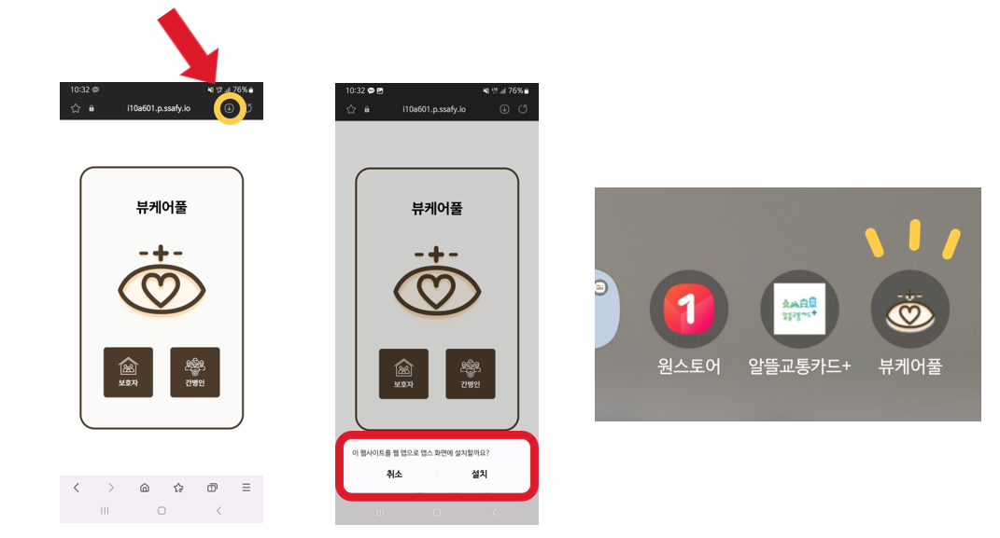
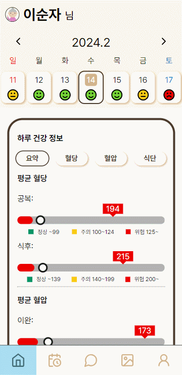
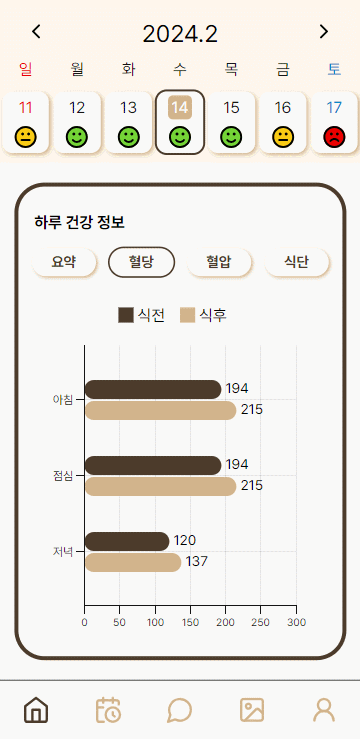
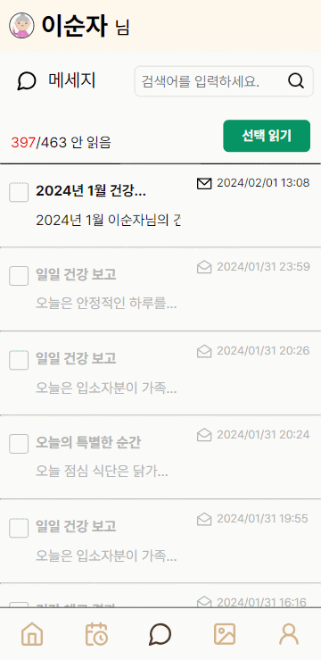
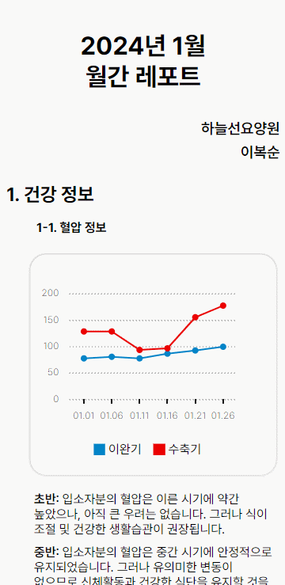
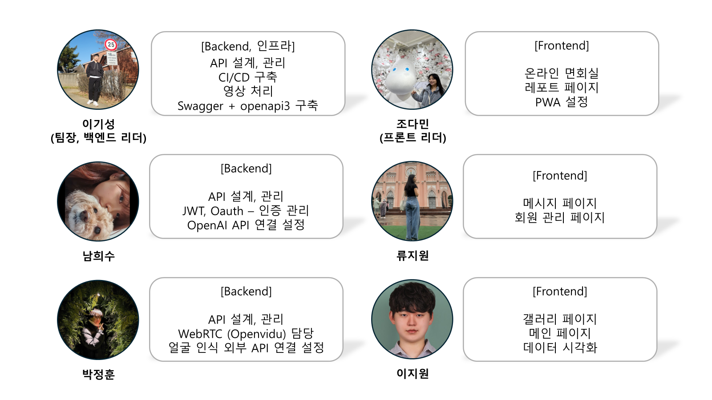
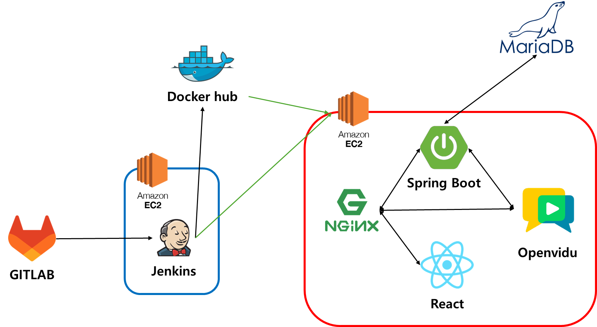
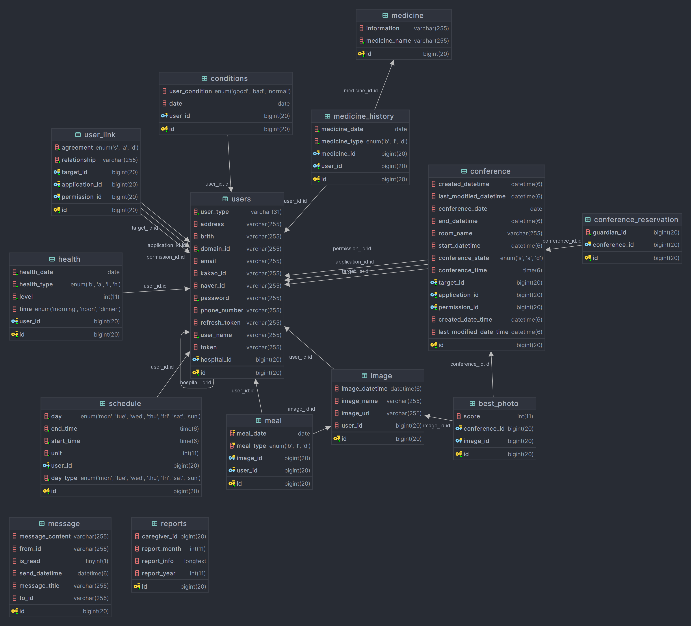
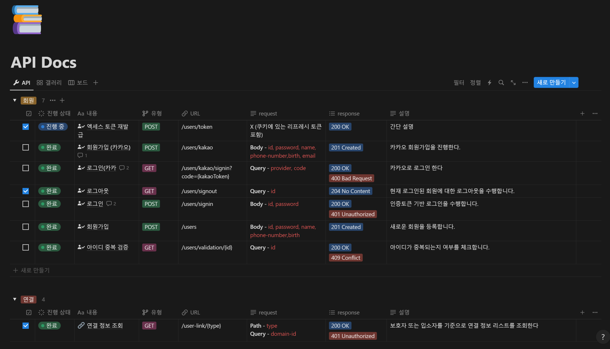

<div align="center">
    
</div>

<div align="center">

#### 보호자와 요양원 사이의 원활한 소통을 돕는 서비스

</div><div align="center">


</div>

<div align="center">
    <a href="#video">Video</a> • 
    <a href="#features">Features</a> •
    <a href="#contributors">Contributors</a> •
    <a href="#directory-structure">Directory Structure</a> •
    <a href="#project-output">Project Output</a> •
    <a href="https://www.notion.so/daminzziA601-71f81b9d61484dc99e9e549473288b04">Notion</a>
</div><div align="center">

📢 본 프로젝트는 2024 Samsung Software Academy For Youth 10기 공통 프로젝트 일환으로 진행되었습니다.

</div>

## 뷰케어풀

### 배경

요양원에서의 생활은 입소자 뿐만 아니라 그 가족과 간병인들에게도 많은 고민을 안겨줍니다.<br/>
특히 코로나 이후 화상면회의 필요성이 더욱 커졌지만, 기존에는 적합한 플랫폼이 없어 개별 연락을 통해 번거로운 스케줄 조율을 해야합니다.

`뷰케어풀`은 요양원 생활에 특화된 편리한 소통 플랫폼으로, 입소자의 생활정보, 식단, 건강정보를 효율적으로 관리할 수 있으며,
메시지와 화상면회 기능을 통해 언제든지 소통이 가능합니다.

`뷰케어풀`은 코로나 이후 더욱 필수적인 화상면회의 요구를 충족시키며,
가족과 간병인들에게는 소통의 불편함을 해소하여 보다 가까운 관계를 형성할 수 있도록 도와주는 서비스입니다.

### 개발기간

2024.01.08 ~ 2024.02.15 (6주)


## Video

### 홍보 영상

<a href="https://youtu.be/Gm4LXf2_LOI?si=SnyHuTJRkVYjZbNx">
  
</a>

### 시연영상

<a href="https://www.youtube.com/watch?v=NzsNZ8ZRi7o">
  
</a>

## Features

### 어플리케이션 사용방법

[웹브라우저로 뷰케어풀 접속하기](https://i10a601.p.ssafy.io/)



### 온라인 화상 면회

<div style="display: flex; justify-content: space-around;">


</div>

- 화상 면회 예약 시스템
- 면회 중 입소자의 표정 인식을 통해 베스트샷으로 찍어 갤러리에 자동 저장

<hr/>

### 일일리포트 조회

<div style="display: flex; justify-content: space-around;">





</div>

- 원하는 날짜의 하루 건강 정보 조회
- 평균 혈당 및 혈압, 식단 조회
- 간병인이 입력한 입소자의 컨디션 조회

<hr/>

### 월간 리포트 조회

<div style="display: flex; justify-content: space-around;">





</div>

- 온라인 화상 면회 중 베스트샷 기능 기반의 추억 영상 자동 생성 후 제공
- Open AI를 사용한 한달간 입소자의 건강 및 생활 정보 요약 리포트 제공


## Contributors




## Directory Structure

<h3> 
<details>
<summary>frontend</summary>
<div markdown="1">

```shell
📦src
├─📂@types
│  └─📂global
├─📂assets
│  ├─📂icons
│  ├─📂images
│  └─📂styles
│     └─📂font
├─📂components
│  ├─📂calendar
│  ├─📂caregiver
│  ├─📂chart
│  ├─📂common
│  ├─📂family
│  ├─📂familyHome
│  ├─📂gallery
│  ├─📂message
│  ├─📂report
│  └─📂visit
├─📂pages
│  ├─📂caregiver
│  │  └─📂CareGiverSendMessage
│  ├─📂family
│  │  └─📂FamilyProfile
│  ├─📂Login
│  └─📂SignUp
├─📂services
│  ├─📂connect
│  ├─📂gallery
│  ├─📂health
│  ├─📂message
│  ├─📂report
│  ├─📂user
│  └─📂visit
└─📂stores
```

</div>
</details>
</h3>

<h3>
<details>
<summary>backend</summary>
<div markdown="1">

```shell
📦src
├─📂main
│ ├─📂java.com.ssafy.ViewCareFull
│ │ ├─📂configuration
│ │ └─📂domain
│ │   ├─🔄common                  # 공통 모듈
│ │   │ └─📂entity
│ │   ├─😊condition               # 컨디션 관련 도메인
│ │   │ ├─📂controller
│ │   │ ├─📂dto
│ │   │ ├─📂entity
│ │   │ ├─📂repository
│ │   │ └─📂service
│ │   ├─🎥conference              # 화상면회 관련 도메인
│ │   │ ├─📂controller
│ │   │ ├─📂dto
│ │   │ ├─📂entity
│ │   │ ├─📂error
│ │   │ │ └─📂exception
│ │   │ ├─📂repository
│ │   │ └─📂service
│ │   ├─📸ffmpeg                  # 화상면회 동영상 처리
│ │   │ ├─📂controller
│ │   │ ├─📂exception
│ │   │ └─📂service
│ │   ├─🖼️gallery                 # 갤러리 관련 도메인
│ │   │ ├─📂controller
│ │   │ ├─📂dto
│ │   │ ├─📂entity
│ │   │ ├─📂exception
│ │   │ ├─📂repository
│ │   │ ├─📂service
│ │   │ └─📂utils
│ │   ├─🎭gcp                     # 얼굴인식을 위한 GCP 관련 도메인
│ │   │ ├─📂controller
│ │   │ ├─📂error
│ │   │ │ └─📂exception
│ │   │ └─📂service
│ │   ├─🌡️health                  # 건강정보 관련 도메인
│ │   │ ├─📂controller
│ │   │ ├─📂dto
│ │   │ ├─📂entity
│ │   │ ├─📂error
│ │   │ │ └─📂exception
│ │   │ ├─📂repository
│ │   │ └─📂service
│ │   ├─📈main                    # 메인화면 관련 도메인
│ │   │ ├─📂controller
│ │   │ ├─📂dto
│ │   │ └─📂service
│ │   ├─💊medicine                # 복약 관련 도메인
│ │   │ ├─📂controller
│ │   │ ├─📂dto
│ │   │ ├─📂entity
│ │   │ ├─📂exception
│ │   │ ├─📂repository
│ │   │ └─📂service
│ │   ├─💌message                 # 메시지 관련 도메인
│ │   │ ├─📂controller
│ │   │ ├─📂dto
│ │   │ ├─📂entity
│ │   │ ├─📂exception
│ │   │ ├─📂repository
│ │   │ └─📂service
│ │   ├─📹openvidu                # 화상면회를 위한 openvidu 관련 도메인
│ │   │ ├─📂controller
│ │   │ ├─📂error
│ │   │ │ └─📂exception
│ │   │ └─📂service
│ │   ├─📋report                  # 월간 리포트 관련 도메인
│ │   │ ├─📂controller
│ │   │ ├─📂dto
│ │   │ │ └─🤖OpenAI              # OpenAI를 사용한 리포트 생성
│ │   │ │   ├─📂Assistant
│ │   │ │   ├─📂Message
│ │   │ │   └─📂Run
│ │   │ ├─📂entity
│ │   │ ├─📂error
│ │   │ │ └─📂exception
│ │   │ ├─📂repository
│ │   │ ├─📂service
│ │   │ └─📂util
│ │   ├─📆schedule                # 면회 스케줄 관련 도메인
│ │   │ ├─📂controller
│ │   │ ├─📂dto
│ │   │ ├─📂entity
│ │   │ ├─📂error
│ │   │ │ └─📂exception
│ │   │ ├─📂repository
│ │   │ └─📂service
│ │   ├─📂test                    # 테스트 관련 도메인
│ │   │ ├─📂controller
│ │   │ └─📂service
│ │   └─👤users                   # 사용자 관련 도메인
│ │       ├─📁controller
│ │       ├─📁dto
│ │       ├─📁entity 
│ │       │  └─📁user
│ │       ├─📁error
│ │       │  └─📁exception
│ │       ├─📁repository
│ │       ├─🔐security            # Spring Security관련 
│ │       │  ├─📁jwt              # JWT 토큰 관련
│ │       │  ├─📁oauth            # OAuth2 관련
│ │       │  └─📁util
│ │       └─📁service
│ └─resources
│   ├─📂static
│   └─📂templates
└─test                              # 도메인별 테스트 코드
    └─java.com.ssa.ViewCareFull
         └─📂domain
             ├─📂condition
             │ └─📂controller
             ├─📂conference
             │ └─📂controller
             ├─📂gallery
             │ └─📂controller
             ├─📂health
             │ └─📂controller
             ├─helper
             ├─main
             │ └─📂controller
             ├─medicine
             │ └─📂controller
             ├─message
             │ └─📂controller
             ├─report
             │ └─📂controller
             ├─schedule
             │ └─📂controller
             ├─test
             │ └─📂controller
             └─users
                 ├─📂controller
                 └─📂service
```

</div>
</details>
</h3>


## Project Output

### <a href="files/01_기능정의서.xlsx">기능정의서</a>
### <a href="files/06_와이어프레임.pdf">와이어프레임</a>

### 시스템 아키텍처



### ERD



### <a href="https://www.notion.so/daminzziAPI-Docs-c338583e13774ea8b891a94485b7817c">api 명세서</a>




