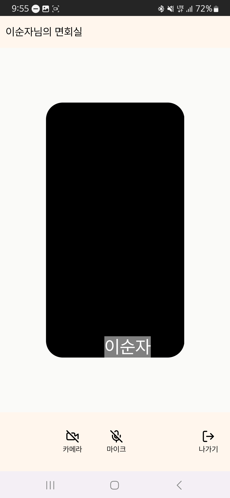
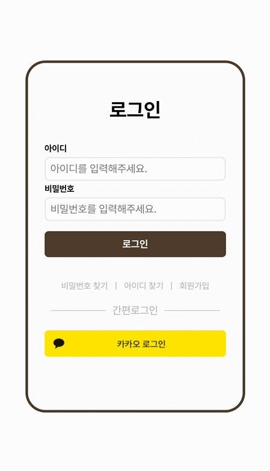
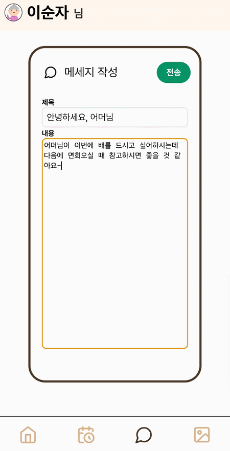

# 시연 시나리오

## 보호자

1. 회원가입

   로그인 페이지에서 회원가입 클릭 시 회원가입 페이지로 이동

    1. 일반 회원가입
        - 아이디 입력 후 중복확인
            - 중복된 아이디가 있는 경우 가입 불가

              

        - 비밀번호 및 비밀번호 확인 입력
        - 이름, 생년월일, 전화번호 입력
        - 모든 정보 입력 후 회원가입 버튼 활성화 시 회원가입 가능
        - 버튼을 눌러 회원 가입

          

    2. 카카오 회원가입
        1. 로그인 페이지에서 카카오로 로그인 했을 때 가입된 회원 정보가 없는 경우 1-a로 연결됨

           

2. 로그인
    - 메인페이지에서 보호자 로그인 클릭

    1. 일반 로그인
        1. 가입한 아이디, 비밀번호를 통해 로그인
            - 시연 아이디: 10damin04
            - 시연 비밀번호: viewcare
        2. 로그인 성공 시 3 또는 4로 연결

           

    2. 카카오 로그인
        1. 카카오 로그인 클릭 후 카카오 인증
        2. 회원 정보가 없을 시 1-a로 연결
        3. 회원 정보가 있을 시 3 또는 4로 연결

           

3. 입소자 연결 신청

    - 회원 가입 후 연결된 입소자가 없는 경우 입소자 연결 신청 페이지로 연결됨
    - 입소자 연결 신청 정보의 경우 요양원에서 사전에 전달해준 정보를 입력하여 신청
    - 연결 신청 정보
        - 요양원명: 싸피요양원
        - 입소자코드: ssafy
        - 입소자명: 컨설턴트님
        - 관계: 자유 선택

4. 메인페이지 건강 정보 확인

   

    1. 캘린더
        - 캘린더에서는 날짜 선택 및 그날의 컨디션 확인 가능

        1. 날짜 클릭 시 날짜 이동
        2. 날짜 스와이프로 주 이동
        3. 월 옆 화살표로 월 이동
    2. 건강 정보
        1. 요약
        2. 혈당
        3. 혈압
        4. 식단
5. 면회 목록 조회

   

    1. 오늘 예정된 면회
        1. 면회 날짜, 시간, 입소자명, 면회 상태 확인 가능
        2. 면회실 바로가기 클릭으로 7로 이동
        3. 오늘 예정된 면회가 없을 시 예정된 면회 없음 멘트 보임
    2. 면회 신청 목록
        1. 신청한 면회 중 최근 10건을 확인할 수 있음
6. 면회 신청

   

    1. 면회 날짜, 시간, 참가할 보호자를 선택(이름 부분 클릭)
    2. 면회 신청 클릭 시 면회 신청되고 면회 목록 조회에서 새로고침 시 신청된 면회 신청을 확인할 수 있음
7. 면회 참가
    1. 면회실 입장

       

        - 면회 목록에서 오늘 예정된 면회 > 면회실 바로가기 링크 클릭 시 면회실 입장
    2. 면회 중 기능
        - 면회 중 다른 사용자 입장 시 레이아웃 변화

          

          

        - 면회 중 비디오 on/off, 오디오 on/off 가능

          

        - 면회 나가기 버튼을 통해 면회실에서 퇴장
    3. 면회 종료 후 기능

       

        - 면회 종료 후 갤러리에서 면회 시 캡쳐된 입소자의 베스트샷을 확인할 수 있음
8. 메세지 조회
    1. 일반 메세지 조회

       

        - 메세지 조회 목록에서 일반 메세지 클릭 시 메세지 확인 가능
    2. 리포트 메세지 조회

       .png)

        - 리포트 메세지 조회 시 리포트 바로가기 버튼을 통해 월간 리포트로 이동할 수 있음
9. 월간 리포트 조회

   

    - 월간 리포트 조회에서 한달의 건강/생활 요약 정보 및 면회 시 캡쳐된 베스트샷을 포함한 생활 영상을 확인할 수 있음.
10. 갤러리 사진 조회

   

    - 갤러리에서는 업로드된 식단 사진, 면회 베스트샷, 생활 사진을 확인할 수 있음
    - 이미지 클릭 시 이미지를 크게 볼 수 있고 우상단 x 버튼을 눌러 사진을 닫을 수 있음
11. 마이페이지 정보 확인

   

    1. 회원정보 확인
    2. 입소자 연결 정보 확인
        - 아코디언 버튼 클릭 시 연결된 다른 보호자를 확인할 수 있음
    3. 입소자 연결 추가 신청
        - 현재 연결된 입소자 외에 다른 입소자를 추가할 수 있음

## 간병인(입소자)

1. 로그인
    1. 메인 페이지에서 간병인 로그인 클릭 후 아이디 비밀번호를 입력하여 로그인할 수 있음
        - 아이디
        - 비밀번호
2. 메인 페이지

   

    1. 면회 정보 확인
        - 오늘 예정된 면회 중 가장 가까운 면회를 확인하고 면회 목록 바로가기로 이동할 수 있음
    2. 식단 사진 업로드
        - 캘린더를 통해 선택된 날짜의 아침/점심/저녁 식단 사진을 업로드할 수 있음
    3. 입소자 컨디션 업로드
        - 캘린더를 통해 선택된 날짜의 입소자의 컨디션을 입력할 수 있음
3. 면회 목록 조회
    1. 오늘 예정된 면회
        1. 면회 날짜, 시간, 입소자명, 면회 상태 확인 가능
        2. 면회실 바로가기 클릭으로 7로 이동
        3. 오늘 예정된 면회가 없을 시 예정된 면회 없음 멘트 보임
    2. 면회 신청 목록
        1. 신청한 면회 중 최근 10건을 확인할 수 있음
4. 면회 참가
    1. 면회실 입장
        - 면회 목록에서 오늘 예정된 면회 > 면회실 바로가기 링크 클릭 시 면회실 입장
    2. 면회 중 기능
        - 면회 중 다른 사용자 입장 시 레이아웃 변화
        - 면회 중 비디오 on/off, 오디오 on/off 가능
        - 면회 시 30초에 한번씩 입소자의 카메라 화면을 서버로 전송하여 베스트샷 평가를 진행
        - 면회 나가기 버튼을 통해 면회실에서 퇴장
    3. 면회 종료 후 기능
        - 면회 종료 시 촬영된 베스트샷 목록 중 최대 상위 3건을 갤러리에 저장(계속해서 무표정일 경우 3장 미만의 사진이 촬영될 수 있음)
        - 면회 종료 후 갤러리에서 면회 시 캡쳐된 입소자의 베스트샷을 확인할 수 있음
5. 메세지 전송

   

    - 메세지 탭을 통해 연결된 보호자 모두에게 메세지를 전송할 수 있음
6. 갤러리
    1. 사진 조회
        - 지금까지 업로드 된 식단 사진, 면회 베스트샷, 생활 사진을 확인할 수 있음
    2. 사진 업로드

       

        1. 사진 업로드 버튼을 통해 사진 업로드 페이지 접근
        2. 사진 첨부 버튼을 통해 업로드할 사진 선택
        3. 취소 버튼을 통해 사진 재선택
        4. 저장 버튼을 통해 사진 업로드
        5. 우상단 돌아가기 버튼을 통해 사진 업로드를 중단
